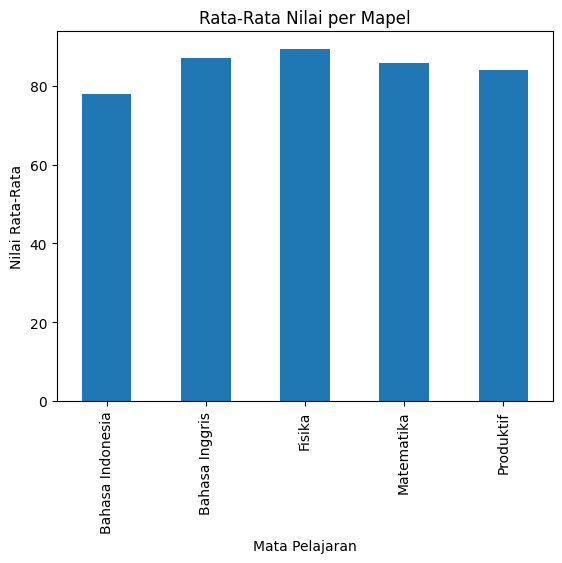
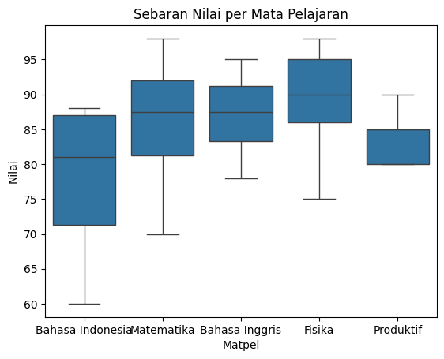

## Hasil Output Program
1. Informasi data set
    <class 'pandas.core.frame.DataFrame'>
    RangeIndex: 28 entries, 0 to 27
    Data columns (total 3 columns):
      Column  Non-Null Count  Dtype 
    ---  ------  --------------  ----- 
    0   Nama    28 non-null     object
    1   Matpel  28 non-null     object
    2   Nilai   28 non-null     int64 
    dtypes: int64(1), object(2)
    memory usage: 804.0+ bytes

2. 5 data pertama
    
Nama	Matpel	Nilai
0	Ade	Bahasa Indonesia	87
1	Bara	Matematika	90
2	Aira	Bahasa Indonesia	88
3	Badi	Bahasa Inggris	78
4	Cyla	Bahasa Inggris	90

3. statistik deskriptif dari dataset
            Nilai
    count	28.000000
    mean	85.071429
    std	8.985291
    min	60.000000
    25%	80.000000
    50%	86.500000
    75%	90.000000
    max	98.000000

4. rata-rata, median, dan modus nilai mata pelajaran
    Rata-rata: 85.07142857142857
    Median: 86.5
    Modus: 90

5. Tampilkan nilai per mata pelajaran
    Nama      Matpel  Nilai
    1     Bara  Matematika     90
    5   Khansa  Matematika     98
    7      Dwi  Matematika     70
    23    Fara  Matematika     85

6. menampilkan nilai mata Pelajaran yang lain seperti (Bahasa Inggris,       Bahasa Indonesia dan Produktif)
        Nama          Matpel  Nilai
    3    Badi  Bahasa Inggris     78
    4    Cyla  Bahasa Inggris     90
    6    Maya  Bahasa Inggris     85
    27  Ahmad  Bahasa Inggris     95

        Nama            Matpel          Nilai
        0     Ade  Bahasa Indonesia     87
    2    Aira  Bahasa Indonesia         88
    12   Agus  Bahasa Indonesia         87
    13  Gilam  Bahasa Indonesia         75
    25   Fani  Bahasa Indonesia         70
    26   Lani  Bahasa Indonesia         60

        Nama     Matpel     Nilai
    10    Mala  Produktif     80
    15  Faizal  Produktif     80
    16   Hanif  Produktif     90
    17  Danish  Produktif     85
    18  Darian  Produktif     85

7. nilai maksimum dan minimum per mata pelajaran
                        max	min
    Matpel		
    Bahasa Indonesia	88	60
    Bahasa Inggris	    95	78
    Fisika	            98	75
    Matematika	        98	70
    Produktif	        90	80

8. grafik batang (bar chart) rata-rata nilai per mapel
   

9. diagram boxplot untuk melihat sebaran nilai
    

10. Kesimpulan
    Dari data yang sudah diberikan rata-rata dari keseluruhan nilai di setiap mata pelajaran oleh setiap siswa adalah 85, median yang diperoleh adalah 86,5 dan modusnya adalah 90. Mata pelajaran fisika memiliki rata-rata nilai paling baik dari setiap mapel yang ada. Mapel produktif memiliki sebaran nilai yang paling kecil.
## Analisis dan Pertanyaan
1. mapel rata rata tertinggi=fisika.
2. mapel nilai terendah=bhs indo.
3. visualisasi dapat membantu memahami data dengan.
## Refleksi Siswa
1. Saya mempelajari bagaimana cara untuk memvisualisasikan data saya di python dan juga melakukan analisis dalam bentuk mencari median,mean,sortir data kedalam beberapa kategori yang diinginkan.
2. Memahami betul bagaimana kode saya dapat bekerja.
3. Menurut saya, tentu saja iya.